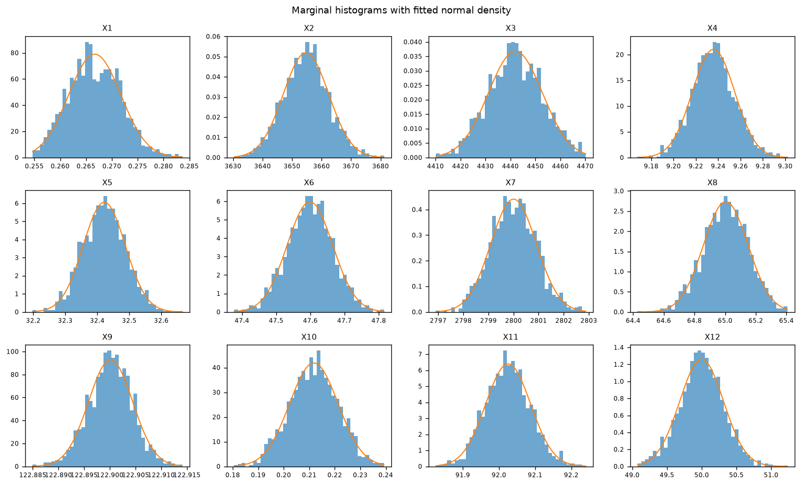
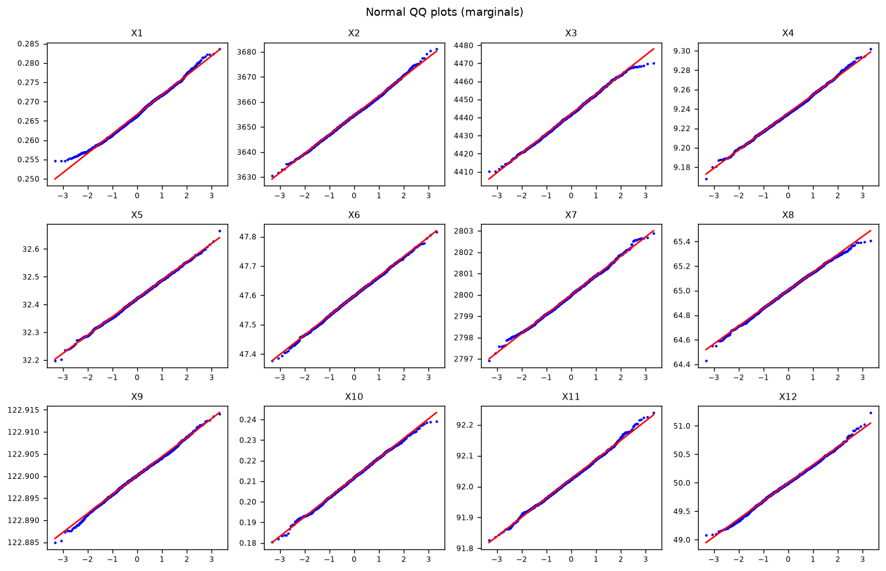
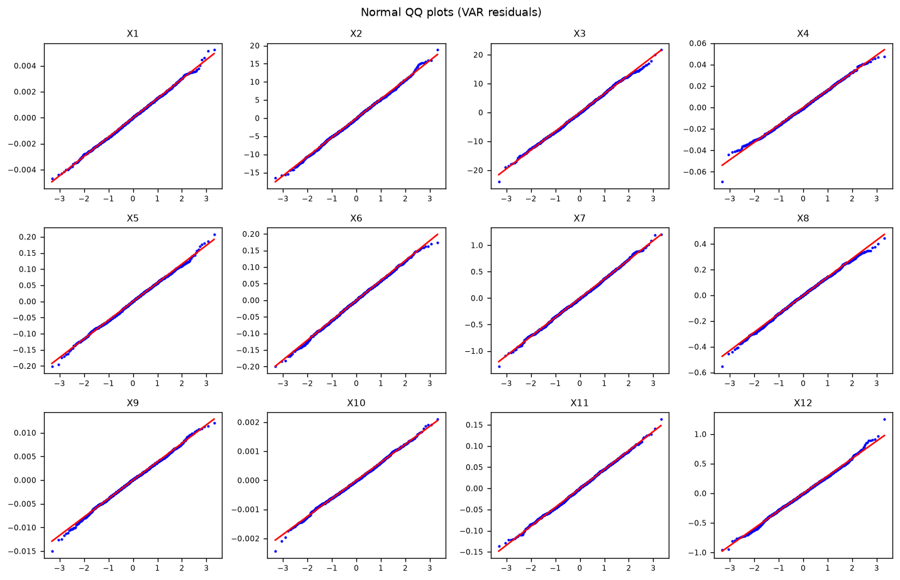
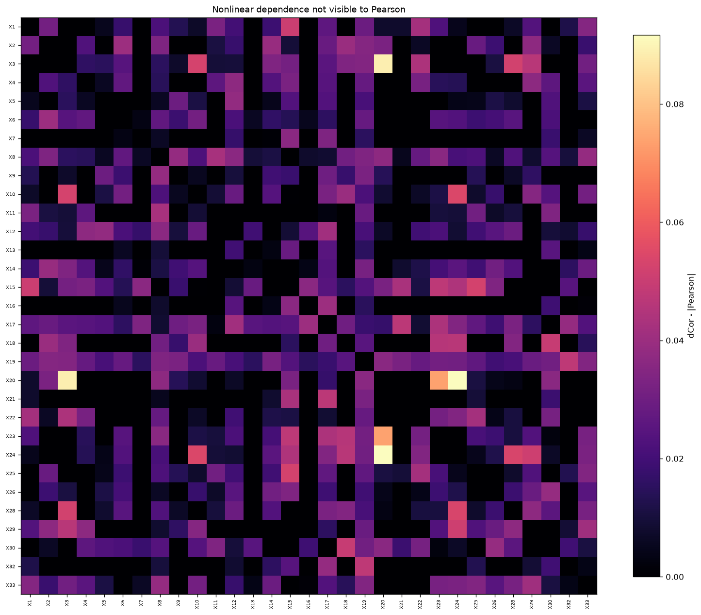
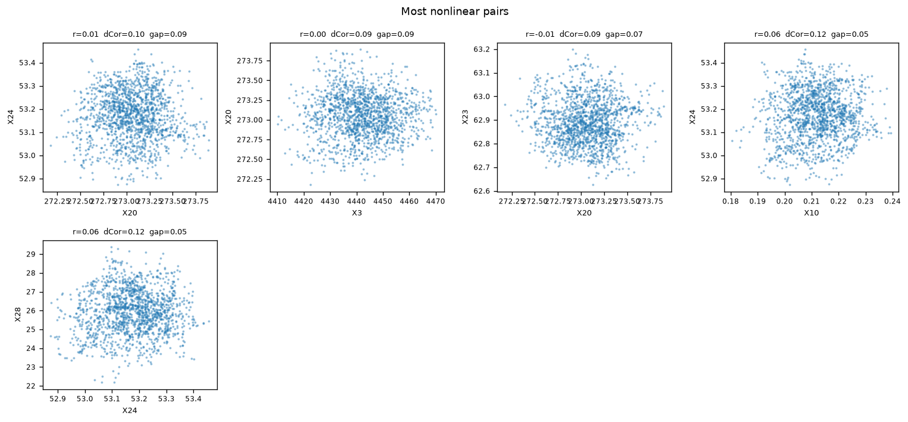
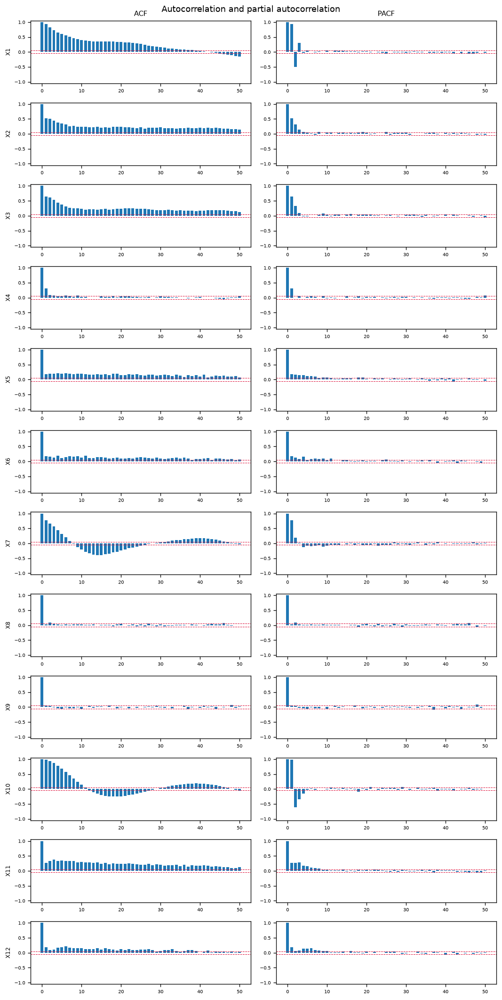
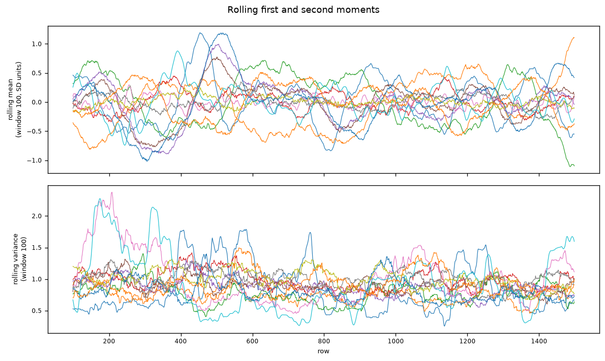
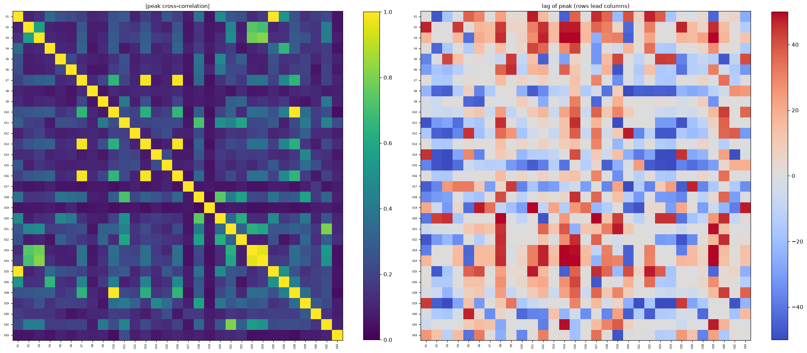

# EDA report: datasetTE.csv

Generated 2026-08-31T00:40:24 from commit `f22a9c7` by `causal-bench eda`. Config: `/Users/gyan/Documents/Root-Cause-Detection/configs/default.yaml`, seed 0.

## Findings

1. **The data is close to Gaussian, not far from it.** Max |skewness| 0.252, max |excess kurtosis| 0.359 across 31 columns. Shapiro-Wilk rejects normality for 6 of 31 at alpha = 0.05, but the effect sizes say those rejections are detections of a trivial departure, not evidence against a Gaussian working assumption.
2. **VAR-LiNGAM is not identifiable here.** The VAR(1) residuals have mean |excess kurtosis| 0.141 and max 0.591, against a threshold of 1.0; max negentropy is 0.008616 nats against a floor of 0.01. Only 0 of 31 equations clear both. The innovations are effectively Gaussian, and ICA has no traction on Gaussian sources.
3. **Samples are not independent, by a wide margin.** Lag-1 autocorrelation runs up to 0.981 (mean 0.522), Ljung-Box rejects independence for 27 of 31 columns, and the binding effective sample size is 36 of 1499 rows -- 2.4% of the nominal count. Plain PC's Fisher-z p-values are anti-conservative by that factor.
4. **Dependence is linear, on every measure tried.** 0 of 465 pairs (0.0%) have distance correlation exceeding |Pearson| by more than 0.1; the largest gap is 0.092. Out of sample, a boosted tree beats a linear fit by a mean R^2 of -0.055 (max 0.018), and Ramsey RESET rejects linearity for 2 of 31 equations.
5. **Not fully stationary, which the lagged methods assume.** ADF calls 30 of 31 columns stationary; KPSS calls 24 stationary; they disagree on 8 (X2, X3, X20, X21, X23, X24, X30, X32). Mean shifts reach 0.47 SD across halves and 0.96 SD across thirds, the latter on 5 column(s).
6. **Lag order is small and the criteria disagree.** AIC = 3, BIC = 1, HQIC = 2, FPE = 3. Any `tau_max` from 1 to 3 is defensible.
7. **The covariance is badly conditioned.** Condition number 3388 against a threshold of 1000, smallest eigenvalue 0.0014, 6 pair(s) at or above |r| = 0.95, and 9 of 31 variables with VIF above 10 (max 365.8). Partial correlations inverting this matrix amplify noise, and no p-value reveals it.
8. **Conditioning sets must stay small.** At 10 observations per estimated parameter the effective sample size supports a conditioning set of 1, against 147 if the row count were taken at face value.
9. **Causal sufficiency is violated by construction.** The ground truth names 2 node(s) absent from the data (X27, X31), carrying 4 edge(s). Those are latent confounders, and 4 of 32 edges cannot be recovered by any method.


**Algorithm outlook**

| Algorithm | Verdict | Assumptions violated by the data |
|---|---|---|
| LSTE | expected to work with caveats | Stationarity, Adequate sample size |
| PC | expected to fail | Independent samples, Adequate sample size, Well-conditioned covariance |
| PCMCI+ | expected to fail | Stationarity, Adequate sample size, Well-conditioned covariance |
| VAR-LiNGAM | expected to fail | Non-Gaussian VAR residuals, Stationarity, Adequate sample size, Well-conditioned covariance |

## 1. Structure and integrity

| Property | Value |
|---|---|
| Rows | 1499 |
| Columns | 31 |
| Index type | RangeIndex |
| Index monotonic increasing | yes |
| Index unique | yes |
| Sampling interval | 1 index units (regular: yes) |
| Missing values | 0 |
| Constant columns | none |
| Near-constant columns | none |
| Discrete / integer-valued columns | none |
| Duplicate rows | 0 |
| Duplicate column groups | none |
| Non-numeric columns | none |

### Data versus ground-truth node set

| Property | Value |
|---|---|
| Ground-truth shape | 33 x 33 |
| Ground-truth edges | 32 |
| Self-loops | 0 |
| Reciprocal pairs | 0 |
| Acyclic | yes |
| Data columns | 31 |
| Alignment | by_name |
| Nodes in ground truth but absent from data | X27, X31 |
| Nodes in data but absent from ground truth | none |
| Edges made unrecoverable by those absences | 4 |
| Usable edges | 28 |

Unrecoverable edges: `X5 -> X27`, `X11 -> X27`, `X19 -> X31`, `X27 -> X20`. Any recall computed against the full edge count is wrong by construction.


## 2. Distribution

| Quantity | Value |
|---|---|
| Columns scored | 31 |
| Max \|skewness\| | 0.2516 |
| Mean \|skewness\| | 0.0794 |
| Max \|excess kurtosis\| | 0.3589 |
| Mean \|excess kurtosis\| | 0.1374 |
| Shapiro-Wilk rejections at 0.05 | 6 / 31 |
| D'Agostino K^2 rejections at 0.05 | 5 / 31 |
| Jarque-Bera rejections at 0.05 | 5 / 31 |
| Anderson-Darling rejections at 0.05 | 7 / 31 |
| Practically Gaussian (\|skew\| < 0.5 and \|excess kurtosis\| < 1.0) | 31 / 31 |

The p-value counts and the effect sizes answer different questions. At n = 1499 a normality test has the power to reject on a departure far too small to disturb a Fisher-z test, so the effect sizes above, not the rejection counts, are what the Gaussian verdict rests on.


### VAR residual non-Gaussianity (VAR-LiNGAM identifiability)

| Quantity | Value |
|---|---|
| VAR lag used | 1 |
| Equations | 31 |
| Residual observations | 1498 |
| Mean \|excess kurtosis\| | 0.1412 |
| Max \|excess kurtosis\| | 0.5906 |
| Mean negentropy (nats) | 0.000879 |
| Max negentropy (nats) | 0.008616 |
| Jarque-Bera rejections | 4 / 31 |
| Equations clearing both thresholds | 0 / 31 |
| Contemporaneous LiNGAM identifiable | no |

**Threshold and justification.** An equation counts as usable when |excess kurtosis| > 1.0 *and* negentropy > 0.01 nats; the dataset counts as identifiable when at least 50% of equations qualify. ICA cannot separate Gaussian sources at all -- a rotation of independent Gaussians is again independent Gaussians -- so the contrast must be large enough to survive finite-sample noise. An excess kurtosis of 1.0 is roughly the point at which the fourth cumulant is estimable at this sample size; the negentropy floor of 0.01 nats is the same statement in the units FastICA actually maximises. Both are config values, not constants in the code.


### Outliers

| Column | Modified z > threshold | IQR rule | Max \|modified z\| |
|---|---|---|---|
| X33 | 3 | 11 | 3.63 |
| X4 | 2 | 15 | 3.7 |
| X9 | 2 | 22 | 3.69 |
| X2 | 1 | 17 | 3.58 |
| X5 | 1 | 8 | 3.64 |
| X8 | 1 | 7 | 3.86 |
| X11 | 1 | 15 | 3.54 |
| X12 | 1 | 20 | 4.1 |
| X15 | 1 | 7 | 3.58 |
| X17 | 1 | 14 | 3.93 |

Counts only. Nothing was removed.


## 3. Linearity

| Quantity | Value |
|---|---|
| Pairs | 465 |
| Max (dCor - \|Pearson\|) | 0.0917 |
| Median (dCor - \|Pearson\|) | 0.0096 |
| Pairs with gap > 0.1 | 0 / 465 (0.0%) |

**Most nonlinear pairs** (largest dCor minus |Pearson|)

| Pair | Pearson | Spearman | dCor | Mutual information | Gap |
|---|---|---|---|---|---|
| X20 - X24 | 0.006 | -0.02 | 0.097 | 0.078 | 0.092 |
| X3 - X20 | 0.004 | -0.026 | 0.093 | 0.016 | 0.089 |
| X20 - X23 | -0.011 | 0.011 | 0.085 | 0.075 | 0.074 |
| X10 - X24 | 0.065 | 0.039 | 0.119 | 0.109 | 0.054 |
| X24 - X28 | 0.064 | 0.038 | 0.118 | 0.114 | 0.054 |

### Linear model versus gradient-boosted tree, out of sample

| Quantity | Value |
|---|---|
| Split | time-ordered (last fraction held out), 1049 train / 450 test |
| Mean R^2 gain of tree over linear | -0.0545 |
| Median R^2 gain | -0.0491 |
| Max R^2 gain | 0.0184 |
| Variables gaining more than 0.05 | 0 / 31 |
| Ramsey RESET rejections at 0.05 | 2 / 31 |

**Largest nonlinear predictive gains**

| Variable | R^2 linear (oos) | R^2 tree (oos) | Gain | RESET p |
|---|---|---|---|---|
| X17 | -0.03 | -0.011 | 0.018 | 0.8488 |
| X1 | 0.994 | 0.991 | -0.003 | 0.3582 |
| X13 | 0.983 | 0.98 | -0.003 | 0.6828 |
| X25 | 0.994 | 0.99 | -0.003 | 0.1984 |
| X28 | 0.997 | 0.992 | -0.005 | 0.3262 |
| X10 | 0.997 | 0.992 | -0.005 | 0.4753 |
| X16 | 0.984 | 0.978 | -0.005 | 0.5913 |
| X7 | 0.983 | 0.977 | -0.005 | 0.4116 |

## 4. Temporal structure

| Quantity | Value |
|---|---|
| Max \|ACF\| at lag 1 | 0.9808 |
| Mean \|ACF\| at lag 1 | 0.5224 |
| Min \|ACF\| at lag 1 | 0.0085 |
| White-noise band | +/- 0.0506 |
| Columns never decorrelating within the lag window | 11 / 31 |
| Median decorrelation lag | 11 |
| Max decorrelation lag | 42 |
| Ljung-Box rejects independence | 27 / 31 |

The decorrelation lag is the first lag at which the autocorrelation falls inside the white-noise band. It is the number that decides whether plain PC's independent-sample assumption is tenable.


### Per-variable decorrelation lag

| Column | ACF(1) | ACF(10) | ACF(50) | Decorrelation lag |
|---|---|---|---|---|
| X1 | 0.942 | 0.399 | -0.154 | 39 |
| X2 | 0.523 | 0.245 | 0.14 | > window |
| X3 | 0.648 | 0.23 | 0.118 | > window |
| X4 | 0.304 | 0.024 | 0.06 | 4 |
| X5 | 0.177 | 0.2 | 0.071 | > window |
| X6 | 0.183 | 0.131 | 0.068 | 38 |
| X7 | 0.77 | -0.213 | -0.03 | 8 |
| X8 | 0.028 | 0.024 | -0.013 | 1 |
| X9 | 0.062 | -0.061 | 0.025 | 2 |
| X10 | 0.979 | 0.14 | -0.063 | 11 |
| X11 | 0.276 | 0.299 | 0.131 | > window |
| X12 | 0.18 | 0.148 | 0.032 | 35 |
| X13 | 0.727 | -0.208 | -0.034 | 8 |
| X14 | 0.181 | 0.142 | 0.063 | 42 |
| X15 | 0.404 | 0.373 | -0.009 | 42 |
| X16 | 0.769 | -0.209 | -0.035 | 8 |
| X17 | 0.03 | 0.033 | -0.037 | 1 |
| X18 | 0.944 | 0.684 | 0.35 | > window |
| X19 | 0.008 | 0.004 | -0.033 | 1 |
| X20 | 0.872 | 0.84 | 0.4 | > window |
| X21 | 0.678 | 0.208 | 0.115 | > window |
| X22 | -0.098 | 0.264 | 0.15 | > window |
| X23 | 0.971 | 0.4 | 0.238 | > window |
| X24 | 0.959 | 0.337 | 0.216 | > window |
| X25 | 0.945 | 0.4 | -0.157 | 39 |
| X26 | 0.676 | 0.062 | 0.011 | 11 |
| X28 | 0.981 | 0.148 | -0.064 | 12 |
| X29 | 0.825 | 0.547 | 0.102 | > window |
| X30 | 0.571 | 0.09 | 0.052 | 34 |
| X32 | 0.445 | 0.131 | 0.078 | 20 |
| X33 | -0.04 | 0.02 | 0.013 | 1 |

### Stationarity

| Quantity | Value |
|---|---|
| ADF says stationary | 30 / 31 |
| KPSS says stationary | 24 / 31 |
| Both agree | 23 / 31 |
| Disagree | 8 / 31 |
| Disagreeing columns | X2, X3, X20, X21, X23, X24, X30, X32 |

ADF's null is a unit root and KPSS's null is stationarity, so they are not redundant. Where they disagree the evidence is genuinely ambiguous -- typically a near-unit-root or trend-stationary series -- and the disagreement is reported rather than resolved.


### Regime stability

| Quantity | Halves | Thirds |
|---|---|---|
| Max mean shift (SD units) | 0.469 | 0.96 |
| Mean mean-shift (SD units) | 0.107 | 0.216 |
| Columns shifted more than 0.5 SD | 0 | 5 |

Changepoint pass (binary segmentation, Gaussian cost, penalty 50.0, minimum segment 100): 6 of 31 columns carry at least one changepoint, 18 in total.


### Lag order

| Criterion | Selected order |
|---|---|
| AIC | 3 |
| BIC | 1 |
| HQIC | 2 |
| FPE | 3 |

Searched up to lag 9. The criteria disagree: AIC and FPE are efficiency criteria and lean long, BIC and HQIC are consistent criteria and lean short. `tau_max` is a modelling choice, not a fact about the data; the widest supported value here is 3.


### Propagation delay

| Quantity | Value |
|---|---|
| Lag window searched | +/- 50 |
| Pairs peaking at a non-zero lag | 418 / 465 (89.9%) |
| Max \|peak lag\| | 50 |
| Median \|peak lag\| | 15 |

Sign convention: peak_lag > 0 means `a` leads `b`.


11 pair(s) peak at the edge of the +/-50 search window, so for those the delay is a lower bound rather than a measurement; widening `eda.temporal.xcorr_max_lag` would settle them.


**Strongest delayed pairs**

| Pair | Peak lag | Peak value | Value at lag 0 |
|---|---|---|---|
| X23 - X24 | -1 | -0.957 | -0.956 |
| X18 - X20 | -13 | 0.746 | 0.664 |
| X11 - X18 | 1 | 0.714 | 0.644 |
| X10 - X16 | -6 | 0.659 | 0.174 |
| X7 - X10 | 6 | 0.655 | 0.163 |
| X16 - X28 | 6 | 0.655 | 0.175 |
| X7 - X28 | 6 | 0.651 | 0.163 |
| X21 - X23 | -1 | -0.637 | -0.621 |

## 5. Conditioning and numerical health

| Quantity | Value |
|---|---|
| Correlation matrix condition number | 3388 |
| Threshold | 1000 |
| Ill conditioned | yes |
| Numerical rank | 31 / 31 |
| Smallest eigenvalue | 0.0014 |
| Five smallest eigenvalues | 0.0014, 0.0026, 0.0097, 0.0104, 0.0286 |
| Max VIF | 365.8 |
| Median VIF | 3.1 |
| Variables with VIF > 10 | 9 / 31 |

**Pairs at or above |r| = 0.9** (6 of 465)

| Pair | Correlation | Above 0.95 |
|---|---|---|
| X10 - X28 | 0.9984 | yes |
| X1 - X25 | 0.9973 | yes |
| X7 - X16 | 0.9875 | yes |
| X7 - X13 | 0.9875 | yes |
| X13 - X16 | 0.9851 | yes |
| X23 - X24 | -0.9559 | yes |

### Effective sample size and conditioning capacity

| Quantity | Value |
|---|---|
| Rows | 1499 |
| Min effective n (AR(1) form, per variable) | 14.5 |
| Median effective n (AR(1) form) | 409.7 |
| Min effective n (Bartlett, per pair) | 36 |
| Median effective n (Bartlett) | 549.1 |
| Binding effective n | 36 |
| Shrinkage factor | 0.024 |
| Practical max conditioning set at raw n | 147 |
| Practical max conditioning set at effective n | 1 |
| Graph ceiling (n_vars - 2) | 29 |
| Recommended max conditioning set | 1 |

The Bartlett form is the one that binds: it governs the variance of a *correlation* estimate, which is exactly what the Fisher-z test studentises. At 10 observations per estimated parameter, the effective sample size is what limits the conditioning set, not the row count.


## 6. Scaling and preprocessing

| Step | Required | Basis | Cost if applied |
|---|---|---|---|
| Standardization | yes | largest/smallest column standard deviation = 2525.2, above 10.0: an unscaled distance or kernel computation would be dominated by the widest variable | none for correlation-based methods, which are scale invariant; changes the units of any reported coefficient |
| Differencing | yes | 1 column(s) fail the ADF stationarity test; 8 more have ADF and KPSS disagreeing | differencing removes contemporaneous level information and changes the causal quantity being estimated from levels to changes; it also injects an MA(1) component that inflates the apparent lag order |
| Marginal transformation | no | 0 column(s) have \|skew\| >= 0.5 (max observed 0.252) | a monotone transform preserves Spearman and distance correlation but changes Pearson, so it alters exactly the test PC relies on; it also breaks the linear additive form VAR-LiNGAM assumes |

This stage reports. No transformation was applied to the data.


## 7. Algorithm suitability

| Assumption | PC | PCMCI+ | VAR-LiNGAM | LSTE | Holds in this data | Supporting number |
|---|---|---|---|---|---|---|
| Gaussian data (marginals) | satisfied | satisfied | n/a | n/a | yes | max \|skew\| = 0.252 (< 0.5), max \|excess kurtosis\| = 0.359 (< 1.0); 0/31 columns exceed either threshold; Shapiro-Wilk rejects 6/31 at alpha=0.05 |
| Non-Gaussian VAR residuals | n/a | n/a | **violated** | n/a | no | VAR(1) residuals: mean \|excess kurtosis\| = 0.141, max = 0.591 (threshold 1.0); max negentropy = 0.00862 (threshold 0.01); 0/31 equations clear both |
| Linear relationships | satisfied | satisfied | satisfied | n/a | yes | 0/465 pairs have distance correlation exceeding \|Pearson\| by more than 0.1 (max gap 0.092, median 0.010); mean out-of-sample R^2 gain of tree over linear = -0.055, max = 0.018; 0/31 variables gain more than 0.05; Ramsey RESET rejects 2/31 |
| Independent samples | **violated** | n/a | n/a | n/a | no | Ljung-Box rejects independence for 27/31 columns; max lag-1 ACF = 0.981, mean = 0.522; binding effective n = 36 of 1499 rows (2.4%) |
| Stationarity | n/a | **violated** | **violated** | **violated** | no | ADF says stationary for 30/31, KPSS for 24/31; the two disagree on 8; max mean shift = 0.47 SD across halves and 0.96 SD across thirds (0 and 5 columns respectively above 0.5 SD); 6 columns carry a detected changepoint |
| Causal sufficiency | **violated** | **violated** | **violated** | **violated** | no | Not identifiable from observational data: no test distinguishes a latent common cause from a direct edge without further assumptions. The ground truth names 2 node(s) absent from the data (X27, X31), carrying 4 edge(s); those are confounders by construction, so sufficiency is known to be violated here. |
| Acyclicity | satisfied | satisfied | satisfied | n/a | yes | Not identifiable from the data itself. The supplied ground truth is acyclic with 0 reciprocal pair(s) and 0 self-loop(s), which is evidence about the target, not about the data. |
| Adequate sample size | **violated** | **violated** | **violated** | **violated** | no | 1499 rows, binding effective n = 36 after the autocorrelation discount; at 10 samples per parameter that supports a conditioning set of 1 (raw-n bound would be 147) |
| Well-conditioned covariance | **violated** | **violated** | **violated** | n/a | no | correlation matrix condition number = 3388 (threshold 1000), rank 31/31, smallest eigenvalue 1.37e-03; 6 pair(s) at or above \|r\| = 0.95; 9 variable(s) with VIF above 10 (max 365.8) |

`n/a` means the algorithm does not rely on that assumption. `unknown` means the data cannot settle it.


### Ranked recommendation


Rule: an assumption the data settles *against* the method counts as a hard violation. Zero gives "expected to work", one or two gives "expected to work with caveats", three or more gives "expected to fail". Causal sufficiency and acyclicity are excluded from the count because the data cannot settle them, and counting them would mark every method as failing on every dataset.


**LSTE - expected to work with caveats**

- ADF says stationary for 30/31, KPSS for 24/31; the two disagree on 8; max mean shift = 0.47 SD across halves and 0.96 SD across thirds (0 and 5 columns respectively above 0.5 SD); 6 columns carry a detected changepoint
- 1499 rows, binding effective n = 36 after the autocorrelation discount; at 10 samples per parameter that supports a conditioning set of 1 (raw-n bound would be 147)

**PC - expected to fail**

- Ljung-Box rejects independence for 27/31 columns; max lag-1 ACF = 0.981, mean = 0.522; binding effective n = 36 of 1499 rows (2.4%)
- 1499 rows, binding effective n = 36 after the autocorrelation discount; at 10 samples per parameter that supports a conditioning set of 1 (raw-n bound would be 147)
- correlation matrix condition number = 3388 (threshold 1000), rank 31/31, smallest eigenvalue 1.37e-03; 6 pair(s) at or above |r| = 0.95; 9 variable(s) with VIF above 10 (max 365.8)

**PCMCI+ - expected to fail**

- ADF says stationary for 30/31, KPSS for 24/31; the two disagree on 8; max mean shift = 0.47 SD across halves and 0.96 SD across thirds (0 and 5 columns respectively above 0.5 SD); 6 columns carry a detected changepoint
- 1499 rows, binding effective n = 36 after the autocorrelation discount; at 10 samples per parameter that supports a conditioning set of 1 (raw-n bound would be 147)
- correlation matrix condition number = 3388 (threshold 1000), rank 31/31, smallest eigenvalue 1.37e-03; 6 pair(s) at or above |r| = 0.95; 9 variable(s) with VIF above 10 (max 365.8)

**VAR-LiNGAM - expected to fail**

- VAR(1) residuals: mean |excess kurtosis| = 0.141, max = 0.591 (threshold 1.0); max negentropy = 0.00862 (threshold 0.01); 0/31 equations clear both
- ADF says stationary for 30/31, KPSS for 24/31; the two disagree on 8; max mean shift = 0.47 SD across halves and 0.96 SD across thirds (0 and 5 columns respectively above 0.5 SD); 6 columns carry a detected changepoint
- 1499 rows, binding effective n = 36 after the autocorrelation discount; at 10 samples per parameter that supports a conditioning set of 1 (raw-n bound would be 147)
- correlation matrix condition number = 3388 (threshold 1000), rank 31/31, smallest eigenvalue 1.37e-03; 6 pair(s) at or above |r| = 0.95; 9 variable(s) with VIF above 10 (max 365.8)

## 8. Verification against an independent reference

Source: independent pass over the same file, supplied with the Phase 2 task specification. 20 of 20 checks match.

| Quantity | Reference | Computed | Tolerance | Match |
|---|---|---|---|---|
| Data rows | 1499 | 1499 | 0 | yes |
| Data columns | 31 | 31 | 0 | yes |
| Ground truth nodes | 33 | 33 | 0 | yes |
| Ground truth edges | 32 | 32 | 0 | yes |
| Ground truth acyclic | yes | yes | undefined | yes |
| Ground truth self-loops | 0 | 0 | 0 | yes |
| Columns absent from data | X27, X31 | X27, X31 | undefined | yes |
| Max \|skewness\| | 0.25 | 0.2516 | 0.05 | yes |
| Max \|excess kurtosis\| | 0.36 | 0.3589 | 0.05 | yes |
| Shapiro-Wilk rejections at 0.05 | 6 | 6 | 0 | yes |
| VAR(1) residual mean \|excess kurtosis\| | 0.14 | 0.1412 | 0.03 | yes |
| ADF stationary at 0.05 | 30 | 30 | 0 | yes |
| VAR order by BIC | 1 | 1 | 0 | yes |
| VAR order by HQIC | 2 | 2 | 0 | yes |
| VAR order by AIC | 3 | 3 | 0 | yes |
| Correlation matrix condition number | 3400 | 3388.0494 | 400 | yes |
| Pairs above \|r\| = 0.9 | 6 | 6 | 0 | yes |
| Highest correlated pair, first variable | X10 | X10 | undefined | yes |
| Highest correlated pair, second variable | X28 | X28 | undefined | yes |
| Highest correlation | 0.998 | 0.9984 | 0.002 | yes |

No mismatch. The loader and the estimators agree with the reference.


## Figures

### Histograms



### Qq Marginals



### Qq Residuals



### Dependence Gap Heatmap



### Nonlinear Pairs



### Acf Pacf



### Rolling Moments



### Cross Correlation




## Reproducing this report

```bash
causal-bench eda --dataset datasetTE.csv --ground-truth TEGroundTruth.txt --reference configs/reference/tennessee_eastman.json --copy-to docs/EDA_REPORT.md
```

Seed 0; every estimator with a random component is seeded from it, so a rerun on the same input reproduces every number.

