# Causal discovery run report

Generated 2026-08-31T02:56:30 from commit `e8f02e8` by `causal-bench run`. Seed 0. Dataset `datasetTE.csv` (1499 rows x 31 variables).

## Results

SHD against **gt_projected**, the primary target: the 30-edge latent projection onto the 31 observed variables. Lower is better; an empty graph would score 30.

| Run | SHD | TP | FP | FN | Rev | Unor | Edges | Seconds | Assumptions met |
|---|---|---|---|---|---|---|---|---|---|
| pc_pk | 47.5 | 4 | 23 | 18 | 5 | 3 | 35 | 2 | **no** |
| pc_manual | 48 | 4 | 23 | 18 | 6 | 2 | 35 | 0.1 | **no** |
| pc | 48.5 | 2 | 23 | 18 | 5 | 5 | 35 | 2.7 | **no** |
| pcmci_plus_tau1_pk | 57 | 8 | 36 | 14 | 6 | 2 | 52 | 13 | **no** |
| pcmci_plus_tau1 | 58 | 7 | 36 | 14 | 7 | 2 | 52 | 13.2 | **no** |
| pcmci_plus_tau3_pk | 61 | 7 | 39 | 16 | 5 | 2 | 53 | 32.6 | **no** |
| pcmci_plus_tau3 | 62.5 | 6 | 39 | 16 | 7 | 1 | 53 | 32.6 | **no** |
| pcmci_plus_tau2_pk | 66 | 2 | 40 | 15 | 9 | 4 | 55 | 16.1 | **no** |
| pcmci_plus_tau2 | 67 | 2 | 40 | 15 | 11 | 2 | 55 | 16.1 | **no** |
| var_lingam_tau1 | 198.5 | 0 | 176 | 11 | 4 | 15 | 195 | 120.7 | **no** |
| var_lingam_tau1_pk | 198.5 | 0 | 176 | 11 | 4 | 15 | 195 | 20.5 | **no** |
| var_lingam_tau2 | 198.5 | 0 | 176 | 11 | 4 | 15 | 195 | 20.9 | **no** |
| var_lingam_tau2_pk | 198.5 | 0 | 176 | 11 | 4 | 15 | 195 | 21.2 | **no** |
| var_lingam_tau3 | 198.5 | 0 | 176 | 11 | 4 | 15 | 195 | 21.4 | **no** |
| var_lingam_tau3_pk | 198.5 | 0 | 176 | 11 | 4 | 15 | 195 | 21.5 | **no** |

An undirected edge scored against a directed one costs 0.5 rather than 1, because a CPDAG's undirected edge is an abstention, not an error.


## Scoring targets

| Target | Nodes | Edges | What it is |
|---|---|---|---|
| gt_full | 33 | 32 | raw ground truth; reference only, nothing is scored against it |
| gt_induced | 31 | 28 | induced subgraph; every edge touching a latent node dropped |
| gt_projected | 31 | 30 | **primary**; latent projection, the graph the data can support |

Latent nodes, derived from the data-versus-ground-truth reconciliation rather than configured: **X27, X31**. Induction drops `X11 -> X27`, `X19 -> X31`, `X27 -> X20`, `X5 -> X27`; the projection recovers `X11 -> X20`, `X5 -> X20` because a latent mediator leaves its parent connected to its child.


**CPDAG floor.** The full ground truth has 9 v-structures, so its CPDAG has 26 directed and 6 undirected edges. Those 6 are undirectable from observational data by any method, which is why the `_cpdag` targets exist: scoring a CPDAG-returning algorithm against a DAG charges it for a limit it cannot beat. On the projected target the CPDAG is 24 directed and 6 undirected.


## Full score table

| Run | Target | SHD | TP | FP | FN | Reversed | Unoriented |
|---|---|---|---|---|---|---|---|
| pc | gt_projected | 48.5 | 2 | 23 | 18 | 5 | 5 |
| pc | gt_projected_cpdag | 47 | 4 | 23 | 18 | 4 | 4 |
| pc | gt_induced | 47.5 | 2 | 24 | 17 | 4 | 5 |
| pc | gt_induced_cpdag | 46 | 4 | 24 | 17 | 3 | 4 |
| pc_pk | gt_projected | 47.5 | 4 | 23 | 18 | 5 | 3 |
| pc_pk | gt_projected_cpdag | 47 | 4 | 23 | 18 | 4 | 4 |
| pc_pk | gt_induced | 46.5 | 4 | 24 | 17 | 4 | 3 |
| pc_pk | gt_induced_cpdag | 46 | 4 | 24 | 17 | 3 | 4 |
| pc_manual | gt_projected | 48 | 4 | 23 | 18 | 6 | 2 |
| pc_manual | gt_projected_cpdag | 47.5 | 3 | 23 | 18 | 4 | 5 |
| pc_manual | gt_induced | 47 | 4 | 24 | 17 | 5 | 2 |
| pc_manual | gt_induced_cpdag | 46.5 | 3 | 24 | 17 | 3 | 5 |
| pcmci_plus_tau1 | gt_projected | 58 | 7 | 36 | 14 | 7 | 2 |
| pcmci_plus_tau1 | gt_projected_cpdag | 56.5 | 7 | 36 | 14 | 4 | 5 |
| pcmci_plus_tau1 | gt_induced | 59 | 6 | 38 | 14 | 6 | 2 |
| pcmci_plus_tau1 | gt_induced_cpdag | 57.5 | 6 | 38 | 14 | 3 | 5 |
| pcmci_plus_tau1_pk | gt_projected | 57 | 8 | 36 | 14 | 6 | 2 |
| pcmci_plus_tau1_pk | gt_projected_cpdag | 55.5 | 8 | 36 | 14 | 3 | 5 |
| pcmci_plus_tau1_pk | gt_induced | 58 | 7 | 38 | 14 | 5 | 2 |
| pcmci_plus_tau1_pk | gt_induced_cpdag | 56.5 | 7 | 38 | 14 | 2 | 5 |
| pcmci_plus_tau2 | gt_projected | 67 | 2 | 40 | 15 | 11 | 2 |
| pcmci_plus_tau2 | gt_projected_cpdag | 64.5 | 2 | 40 | 15 | 6 | 7 |
| pcmci_plus_tau2 | gt_induced | 68 | 1 | 42 | 15 | 10 | 2 |
| pcmci_plus_tau2 | gt_induced_cpdag | 65.5 | 1 | 42 | 15 | 5 | 7 |
| pcmci_plus_tau2_pk | gt_projected | 66 | 2 | 40 | 15 | 9 | 4 |
| pcmci_plus_tau2_pk | gt_projected_cpdag | 63.5 | 3 | 40 | 15 | 5 | 7 |
| pcmci_plus_tau2_pk | gt_induced | 67 | 1 | 42 | 15 | 8 | 4 |
| pcmci_plus_tau2_pk | gt_induced_cpdag | 64.5 | 2 | 42 | 15 | 4 | 7 |
| pcmci_plus_tau3 | gt_projected | 62.5 | 6 | 39 | 16 | 7 | 1 |
| pcmci_plus_tau3 | gt_projected_cpdag | 61 | 5 | 39 | 16 | 3 | 6 |
| pcmci_plus_tau3 | gt_induced | 62.5 | 5 | 40 | 15 | 7 | 1 |
| pcmci_plus_tau3 | gt_induced_cpdag | 61 | 4 | 40 | 15 | 3 | 6 |
| pcmci_plus_tau3_pk | gt_projected | 61 | 7 | 39 | 16 | 5 | 2 |
| pcmci_plus_tau3_pk | gt_projected_cpdag | 59.5 | 7 | 39 | 16 | 2 | 5 |
| pcmci_plus_tau3_pk | gt_induced | 61 | 6 | 40 | 15 | 5 | 2 |
| pcmci_plus_tau3_pk | gt_induced_cpdag | 59.5 | 6 | 40 | 15 | 2 | 5 |
| var_lingam_tau1 | gt_projected | 198.5 | 0 | 176 | 11 | 4 | 15 |
| var_lingam_tau1 | gt_projected_cpdag | 196 | 5 | 176 | 11 | 4 | 10 |
| var_lingam_tau1 | gt_induced | 199.5 | 0 | 178 | 11 | 4 | 13 |
| var_lingam_tau1 | gt_induced_cpdag | 197 | 5 | 178 | 11 | 4 | 8 |
| var_lingam_tau1_pk | gt_projected | 198.5 | 0 | 176 | 11 | 4 | 15 |
| var_lingam_tau1_pk | gt_projected_cpdag | 196 | 5 | 176 | 11 | 4 | 10 |
| var_lingam_tau1_pk | gt_induced | 199.5 | 0 | 178 | 11 | 4 | 13 |
| var_lingam_tau1_pk | gt_induced_cpdag | 197 | 5 | 178 | 11 | 4 | 8 |
| var_lingam_tau2 | gt_projected | 198.5 | 0 | 176 | 11 | 4 | 15 |
| var_lingam_tau2 | gt_projected_cpdag | 196 | 5 | 176 | 11 | 4 | 10 |
| var_lingam_tau2 | gt_induced | 199.5 | 0 | 178 | 11 | 4 | 13 |
| var_lingam_tau2 | gt_induced_cpdag | 197 | 5 | 178 | 11 | 4 | 8 |
| var_lingam_tau2_pk | gt_projected | 198.5 | 0 | 176 | 11 | 4 | 15 |
| var_lingam_tau2_pk | gt_projected_cpdag | 196 | 5 | 176 | 11 | 4 | 10 |
| var_lingam_tau2_pk | gt_induced | 199.5 | 0 | 178 | 11 | 4 | 13 |
| var_lingam_tau2_pk | gt_induced_cpdag | 197 | 5 | 178 | 11 | 4 | 8 |
| var_lingam_tau3 | gt_projected | 198.5 | 0 | 176 | 11 | 4 | 15 |
| var_lingam_tau3 | gt_projected_cpdag | 196 | 5 | 176 | 11 | 4 | 10 |
| var_lingam_tau3 | gt_induced | 199.5 | 0 | 178 | 11 | 4 | 13 |
| var_lingam_tau3 | gt_induced_cpdag | 197 | 5 | 178 | 11 | 4 | 8 |
| var_lingam_tau3_pk | gt_projected | 198.5 | 0 | 176 | 11 | 4 | 15 |
| var_lingam_tau3_pk | gt_projected_cpdag | 196 | 5 | 176 | 11 | 4 | 10 |
| var_lingam_tau3_pk | gt_induced | 199.5 | 0 | 178 | 11 | 4 | 13 |
| var_lingam_tau3_pk | gt_induced_cpdag | 197 | 5 | 178 | 11 | 4 | 8 |

## Assumptions and failures

Every requested run completed.


**Completed but mis-specified.** These ran to completion under assumptions the data violates. The graph exists; whether it means anything is what the note says.

| Run | Violated assumption and the number |
|---|---|
| pc | independent samples: max lag-1 autocorrelation 0.981 exceeds 0.3; binding effective n is 36 of 1499 rows, so nominal p-values are anti-conservative |
| pc | well-conditioned covariance: condition number 3388 exceeds 1000, so the partial correlations the Fisher-z test inverts amplify noise |
| pc_pk | independent samples: max lag-1 autocorrelation 0.981 exceeds 0.3; binding effective n is 36 of 1499 rows, so nominal p-values are anti-conservative |
| pc_pk | well-conditioned covariance: condition number 3388 exceeds 1000, so the partial correlations the Fisher-z test inverts amplify noise |
| pc_manual | independent samples: max lag-1 autocorrelation 0.981 exceeds 0.3; binding effective n is 36 of 1499 rows, so nominal p-values are anti-conservative |
| pc_manual | well-conditioned covariance: condition number 3388 exceeds 1000, so the partial correlations the Fisher-z test inverts amplify noise |
| pcmci_plus_tau1 | stationarity: ADF calls only 30/31 columns stationary and KPSS only 24; the two disagree on 8 |
| pcmci_plus_tau1 | stationarity: 5 column(s) shift their mean by more than 0.5 SD between segments (max 0.96 SD across thirds) |
| pcmci_plus_tau1 | well-conditioned covariance: condition number 3388; ParCorr inverts this matrix, so its p-values are unreliable |
| pcmci_plus_tau1_pk | stationarity: ADF calls only 30/31 columns stationary and KPSS only 24; the two disagree on 8 |
| pcmci_plus_tau1_pk | stationarity: 5 column(s) shift their mean by more than 0.5 SD between segments (max 0.96 SD across thirds) |
| pcmci_plus_tau1_pk | well-conditioned covariance: condition number 3388; ParCorr inverts this matrix, so its p-values are unreliable |
| pcmci_plus_tau2 | stationarity: ADF calls only 30/31 columns stationary and KPSS only 24; the two disagree on 8 |
| pcmci_plus_tau2 | stationarity: 5 column(s) shift their mean by more than 0.5 SD between segments (max 0.96 SD across thirds) |
| pcmci_plus_tau2 | well-conditioned covariance: condition number 3388; ParCorr inverts this matrix, so its p-values are unreliable |
| pcmci_plus_tau2_pk | stationarity: ADF calls only 30/31 columns stationary and KPSS only 24; the two disagree on 8 |
| pcmci_plus_tau2_pk | stationarity: 5 column(s) shift their mean by more than 0.5 SD between segments (max 0.96 SD across thirds) |
| pcmci_plus_tau2_pk | well-conditioned covariance: condition number 3388; ParCorr inverts this matrix, so its p-values are unreliable |
| pcmci_plus_tau3 | stationarity: ADF calls only 30/31 columns stationary and KPSS only 24; the two disagree on 8 |
| pcmci_plus_tau3 | stationarity: 5 column(s) shift their mean by more than 0.5 SD between segments (max 0.96 SD across thirds) |
| pcmci_plus_tau3 | well-conditioned covariance: condition number 3388; ParCorr inverts this matrix, so its p-values are unreliable |
| pcmci_plus_tau3_pk | stationarity: ADF calls only 30/31 columns stationary and KPSS only 24; the two disagree on 8 |
| pcmci_plus_tau3_pk | stationarity: 5 column(s) shift their mean by more than 0.5 SD between segments (max 0.96 SD across thirds) |
| pcmci_plus_tau3_pk | well-conditioned covariance: condition number 3388; ParCorr inverts this matrix, so its p-values are unreliable |
| var_lingam_tau1 | non-Gaussian residuals: only 0/31 VAR residual equations clear the non-Gaussianity thresholds (mean \|excess kurtosis\| 0.141, max negentropy 0.00862 nats). ICA cannot separate Gaussian sources, so the contemporaneous B0 is not identified |
| var_lingam_tau1 | stationarity: ADF calls only 30/31 columns stationary |
| var_lingam_tau1_pk | non-Gaussian residuals: only 0/31 VAR residual equations clear the non-Gaussianity thresholds (mean \|excess kurtosis\| 0.141, max negentropy 0.00862 nats). ICA cannot separate Gaussian sources, so the contemporaneous B0 is not identified |
| var_lingam_tau1_pk | stationarity: ADF calls only 30/31 columns stationary |
| var_lingam_tau2 | non-Gaussian residuals: only 0/31 VAR residual equations clear the non-Gaussianity thresholds (mean \|excess kurtosis\| 0.141, max negentropy 0.00862 nats). ICA cannot separate Gaussian sources, so the contemporaneous B0 is not identified |
| var_lingam_tau2 | stationarity: ADF calls only 30/31 columns stationary |
| var_lingam_tau2_pk | non-Gaussian residuals: only 0/31 VAR residual equations clear the non-Gaussianity thresholds (mean \|excess kurtosis\| 0.141, max negentropy 0.00862 nats). ICA cannot separate Gaussian sources, so the contemporaneous B0 is not identified |
| var_lingam_tau2_pk | stationarity: ADF calls only 30/31 columns stationary |
| var_lingam_tau3 | non-Gaussian residuals: only 0/31 VAR residual equations clear the non-Gaussianity thresholds (mean \|excess kurtosis\| 0.141, max negentropy 0.00862 nats). ICA cannot separate Gaussian sources, so the contemporaneous B0 is not identified |
| var_lingam_tau3 | stationarity: ADF calls only 30/31 columns stationary |
| var_lingam_tau3_pk | non-Gaussian residuals: only 0/31 VAR residual equations clear the non-Gaussianity thresholds (mean \|excess kurtosis\| 0.141, max negentropy 0.00862 nats). ICA cannot separate Gaussian sources, so the contemporaneous B0 is not identified |
| var_lingam_tau3_pk | stationarity: ADF calls only 30/31 columns stationary |

## Per-algorithm notes


**`pc`** -- collider rule: `majority`; skeleton: PC-stable (order independent).

**`pc_pk`** -- collider rule: `majority`; skeleton: PC-stable (order independent).

**`pc_manual`** -- collider rule: `plain (unshielded colliders, no majority vote)`; skeleton: PC-stable (order independent).

**`pcmci_plus_tau1`** -- collider rule: `majority`; independence test: `parcorr`.

**`pcmci_plus_tau1_pk`** -- collider rule: `majority`; independence test: `parcorr`.

**`pcmci_plus_tau2`** -- collider rule: `majority`; independence test: `parcorr`.

**`pcmci_plus_tau2_pk`** -- collider rule: `majority`; independence test: `parcorr`.

**`pcmci_plus_tau3`** -- collider rule: `majority`; independence test: `parcorr`.

**`pcmci_plus_tau3_pk`** -- collider rule: `majority`; independence test: `parcorr`.

**`var_lingam_tau1`** -- 229 lagged edges and 110 contemporaneous.

  Lag-0 bootstrap over 10 resamples: 457 distinct contemporaneous edges appeared at least once, of which 84 were selected in at least half the resamples. Highest selection frequency 1, median 0.2, mean direction-flip rate 0.143. A selection frequency near 1.0 means a resample-stable edge. A direction flip rate near 0.5 means the two orientations are chosen about equally often, i.e. the contemporaneous direction is not identified from this data.

  Error independence: 22/465 residual pairs reject independence at 0.05 (min p 0). LiNGAM assumes mutually independent errors; rejections mean the fitted model leaves dependence unexplained.

**`var_lingam_tau1_pk`** -- 229 lagged edges and 110 contemporaneous.

  Error independence: 22/465 residual pairs reject independence at 0.05 (min p 0). LiNGAM assumes mutually independent errors; rejections mean the fitted model leaves dependence unexplained.

**`var_lingam_tau2`** -- 229 lagged edges and 110 contemporaneous.

  Error independence: 22/465 residual pairs reject independence at 0.05 (min p 0). LiNGAM assumes mutually independent errors; rejections mean the fitted model leaves dependence unexplained.

**`var_lingam_tau2_pk`** -- 229 lagged edges and 110 contemporaneous.

  Error independence: 22/465 residual pairs reject independence at 0.05 (min p 0). LiNGAM assumes mutually independent errors; rejections mean the fitted model leaves dependence unexplained.

**`var_lingam_tau3`** -- 229 lagged edges and 110 contemporaneous.

  Error independence: 22/465 residual pairs reject independence at 0.05 (min p 0). LiNGAM assumes mutually independent errors; rejections mean the fitted model leaves dependence unexplained.

**`var_lingam_tau3_pk`** -- 229 lagged edges and 110 contemporaneous.

  Error independence: 22/465 residual pairs reject independence at 0.05 (min p 0). LiNGAM assumes mutually independent errors; rejections mean the fitted model leaves dependence unexplained.

## Prior knowledge

Source: `/Users/gyan/Documents/Root-Cause-Detection/configs/prior_knowledge/te_controller_loops.yaml`. 4 of 5 declared edges apply to this dataset. 1 were dropped because they name variables with no column in the data (X27).
| Cause | Effect | Lag | Kind |
|---|---|---|---|
| X10 | X28 | 0 | forced |
| X1 | X25 | 0 | forced |
| X28 | X10 | 0 | forbidden |
| X25 | X1 | 0 | forbidden |
**This prior is an oracle, not domain knowledge.** Which pairs are candidates was measured (the Phase 2 near-unity correlations), but the direction of every forced edge was taken from the ground truth file. A with-prior-knowledge score therefore shows that the machinery works and gives a best case; it is not independent validation of anything.

**The ground truth cannot confirm a controller loop.** It is acyclic with no reciprocal pairs, so the feedback structure a controller loop would produce is absent from the target by construction. The machinery is built and tested; this dataset cannot exercise it.


## Parameters and provenance

| Setting | Value | Source |
|---|---|---|
| seed | 0 | config discovery.seed |
| tau values | 1, 2, 3 | EDA VAR order selection, swept over the full range 1..3 because the criteria disagree (AIC=3, BIC=1, HQIC=2, FPE=3) |
| standardize | yes | EDA preprocessing advice: largest/smallest column standard deviation = 2525.2, above 10.0: an unscaled distance or kernel computation would be dominated by the widest variable |
| undirected weight | 0.5 | config discovery.undirected_weight |
| EDA report | /Users/gyan/Documents/Root-Cause-Detection/results/eda/eda-20260831-005002/eda_report.json | phase 2 handoff |
| config | /Users/gyan/Documents/Root-Cause-Detection/configs/default.yaml | --config |

**Library versions**

| Package | Version |
|---|---|
| tigramite | 5.2.10.1 |
| lingam | 1.13.0 |
| networkx | 3.6.1 |
| numpy | 2.5.2 |
| scipy | 1.18.1 |
| statsmodels | 0.15.0 |

## Figures

### ground truth

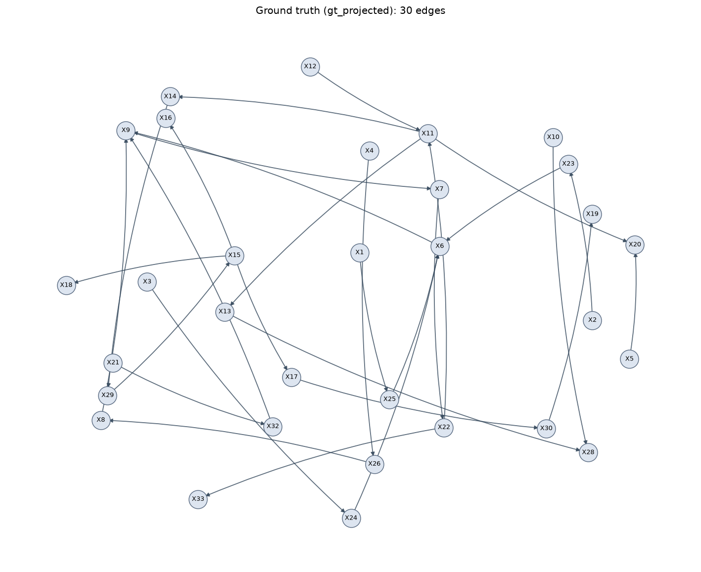

### pc

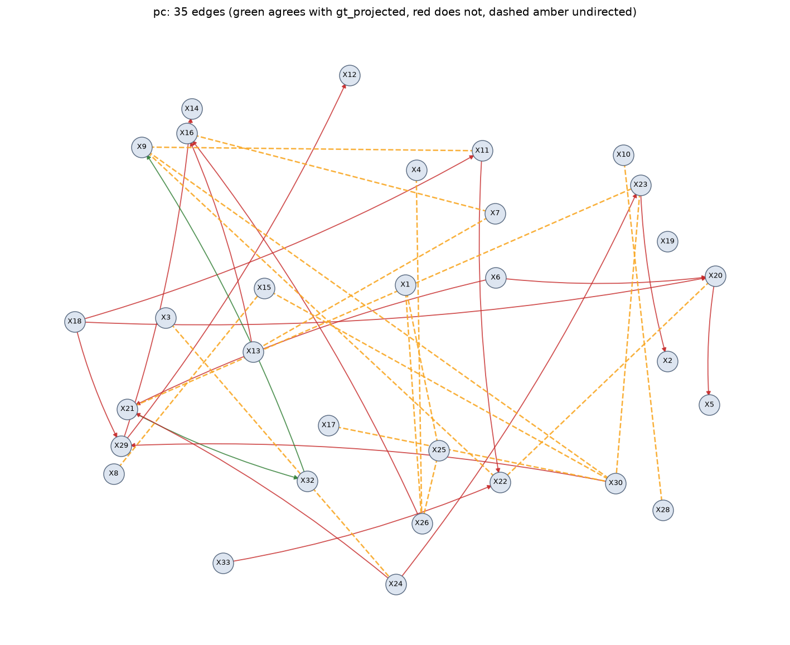

### pc pk

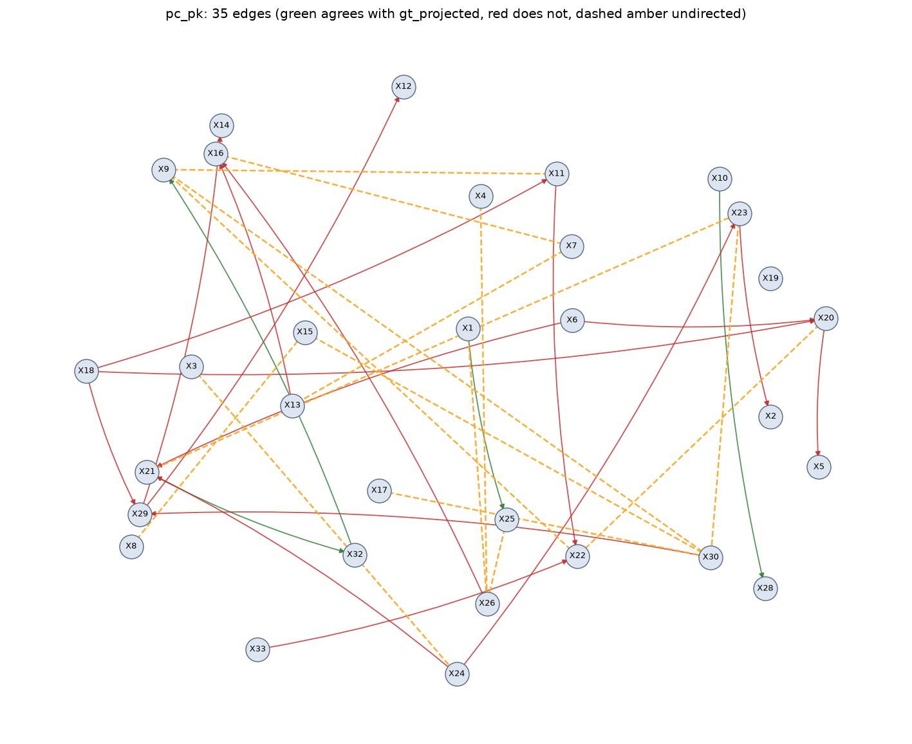

### pc manual

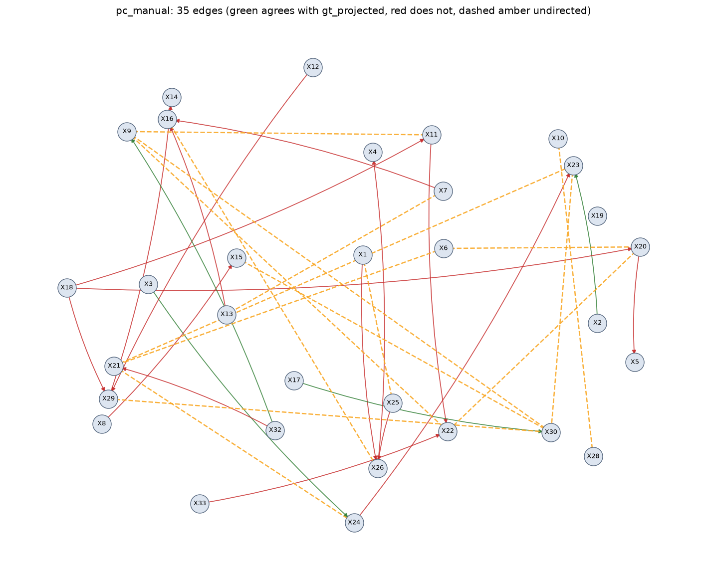

### pcmci plus tau1

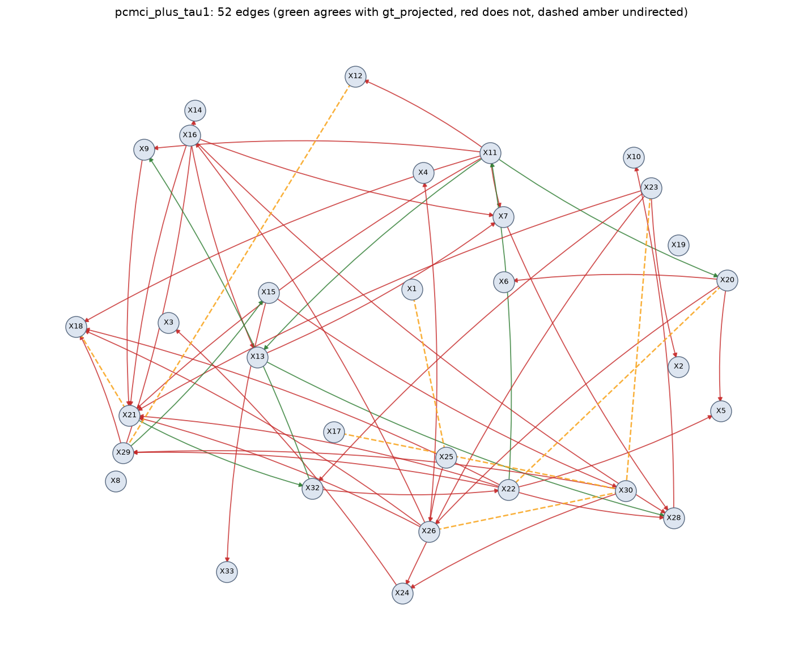

### pcmci plus tau1 pk

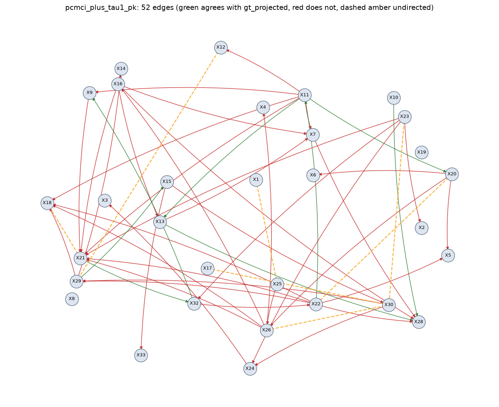

### pcmci plus tau2

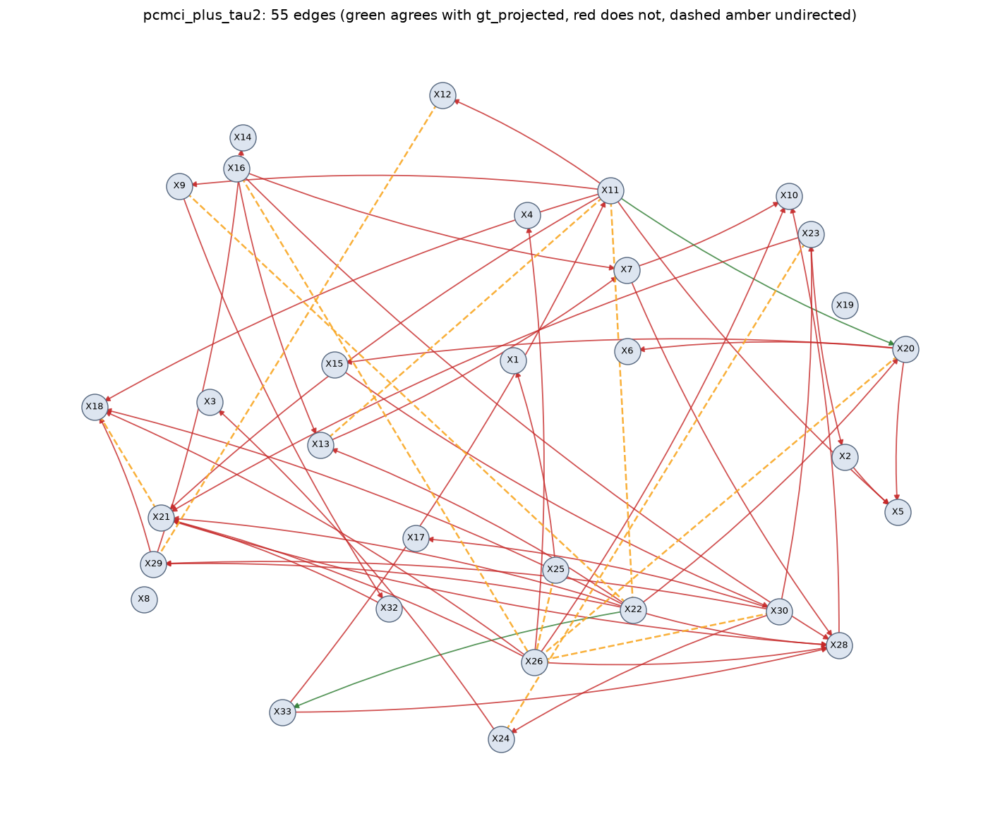

### pcmci plus tau2 pk

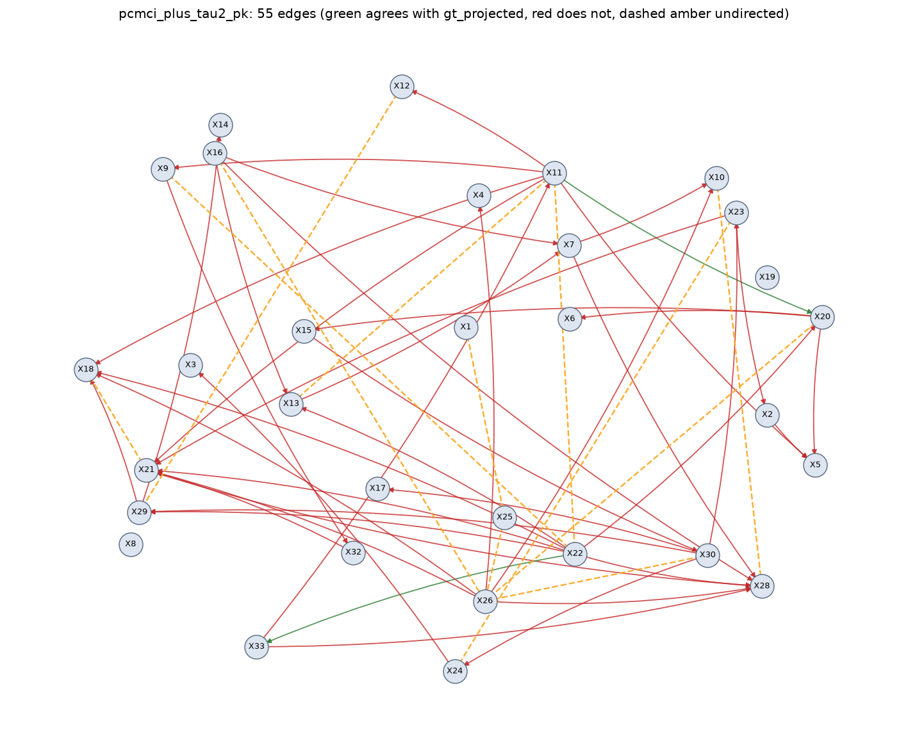

### pcmci plus tau3

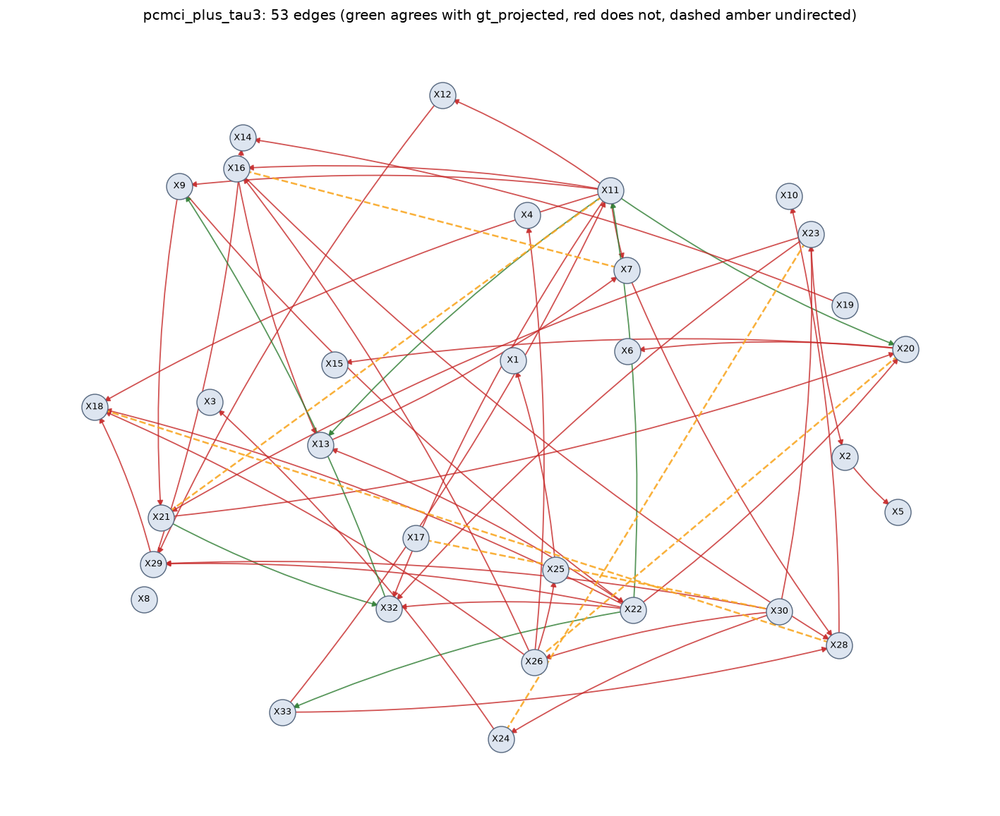

### pcmci plus tau3 pk

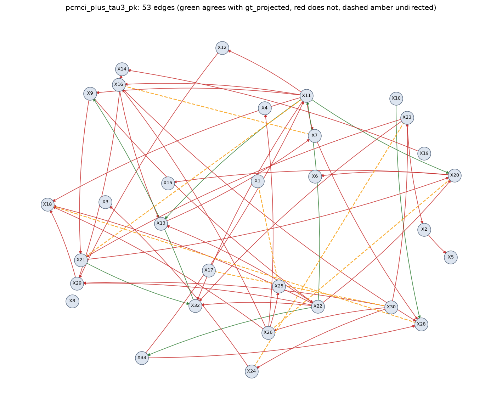

### var lingam tau1


### var lingam tau1 pk


### var lingam tau2


### var lingam tau2 pk

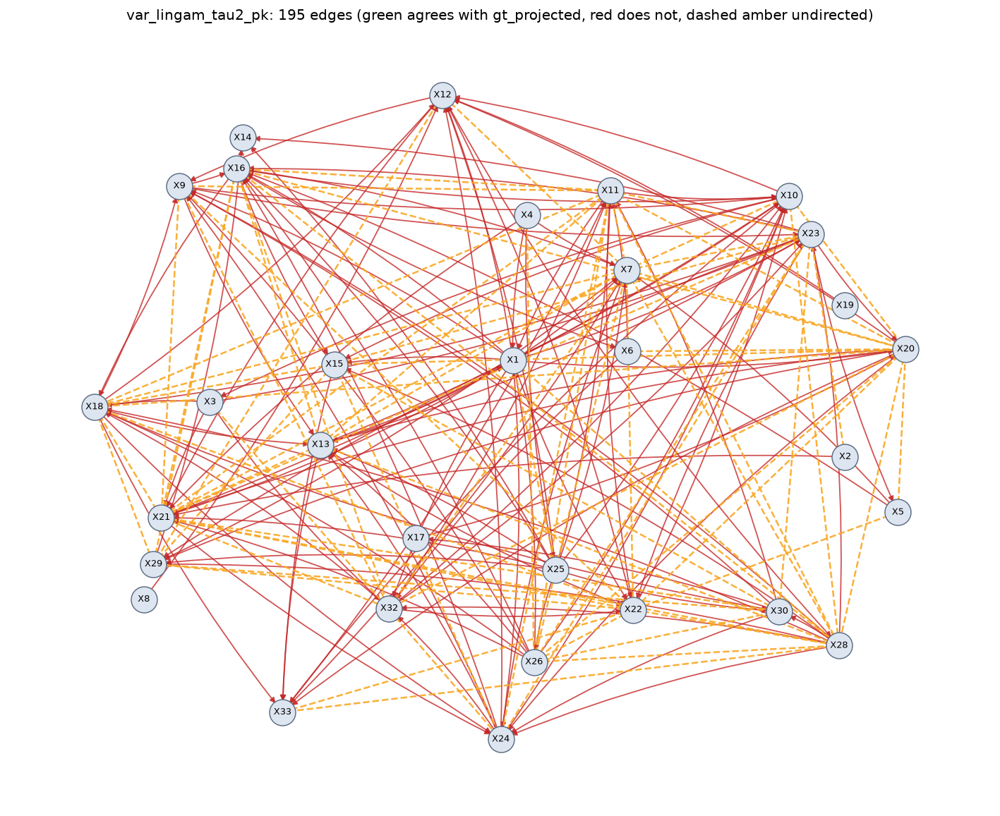

### var lingam tau3

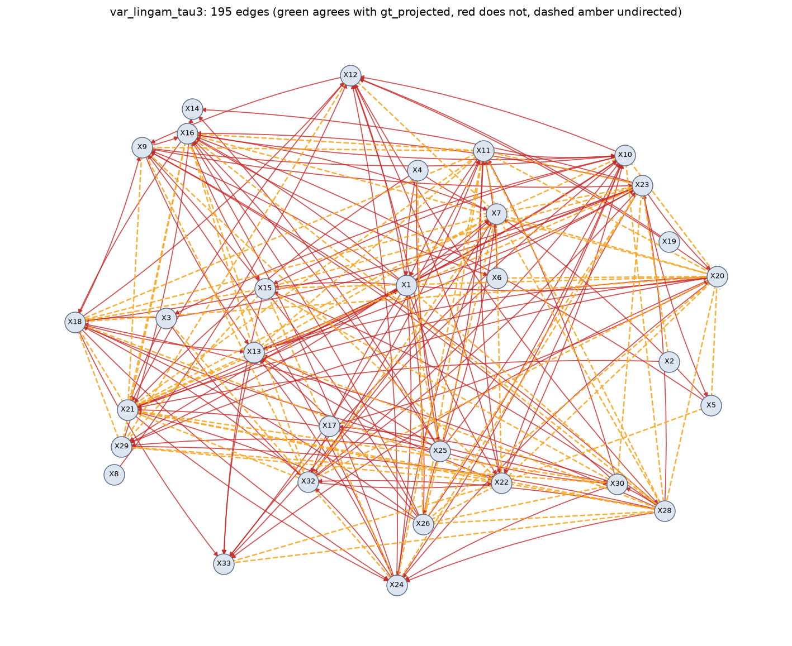

### var lingam tau3 pk


## Reproducing this run

```bash
causal-bench run --algorithms pc,pc_manual,pcmci_plus,var_lingam --out results/runs
```

Total runtime 358s.

